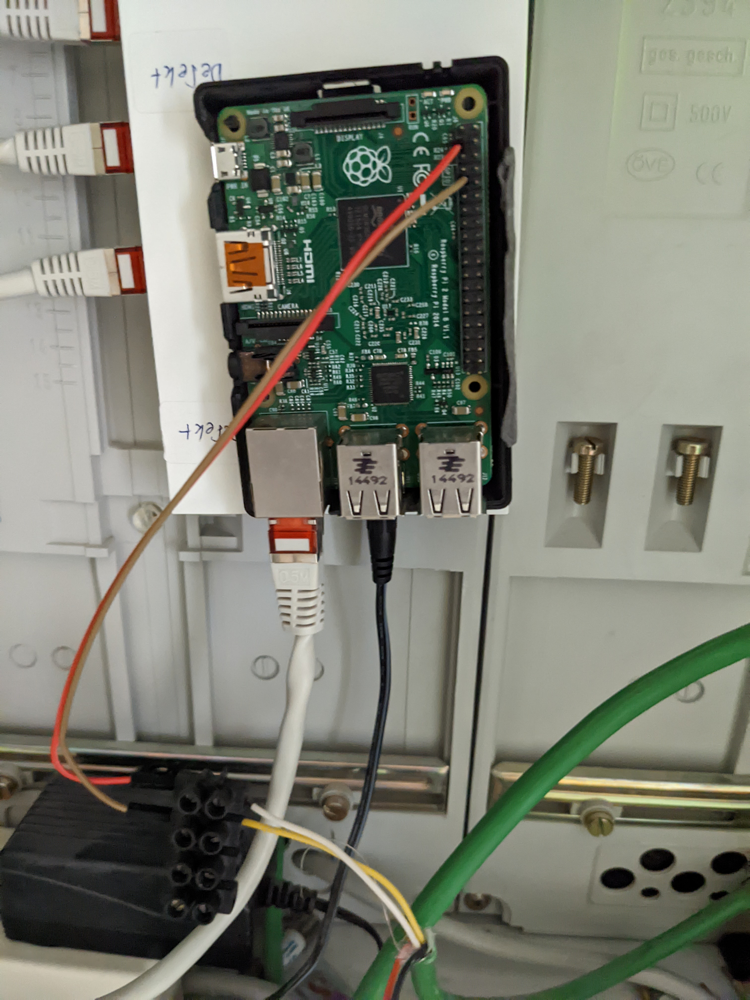

S0/Impulse daemon to Volkszähler and an influxdb
==================================

This is a Linux daemon. Written in python
Its fully interrupt driven with no cpu eating idle loops!

This program is free software: you can redistribute it and/or modify
it under the terms of the GNU General Public License as published by
the Free Software Foundation, either version 3 of the License, or
(at your option) any later version.

This program is distributed in the hope that it will be useful,
but WITHOUT ANY WARRANTY; without even the implied warranty of
MERCHANTABILITY or FITNESS FOR A PARTICULAR PURPOSE.  See the
GNU General Public License for more details.

You should have received a copy of the GNU General Public License
along with this program.  If not, see <http://www.gnu.org/licenses/>.

Raspberry pi preparation
============
## Python

An actual Pyhton Version e.g, 3.9 must be installed.
Following packages must also be installed best with pip3
```
- pip3 install requests
- pip3 install ConfigArgParse
- pip3 install RPi.GPIO
- pip3 pip install influxdb 
    - or sudo apt-get install python-influxdb
- further packages are required?
```

### Configure GPIO as input<br>
```
sudo raspi-gpio set 2 ip
```
with "sudo raspi-gpio get 2" the setting from the GPIO can checked<br>
sample output:

```GPIO 2: level=1 fsel=0 func=INPUT```


## Before BullsEye
### Configure GPIO as input<br>
At first it must created<br>
eg GPIO2:
```
echo 2 > /sys/class/gpio/export
```
now set as input
```
echo in > /sys/class/gpio/gpio2/direction
```

### GPIO-state
To determine the state, i.e. "high" or "low", at a GPIO, the following command is sufficient. The GPIO can be both an input and an output.
```
cat /sys/class/gpio/gpio2/value
```
On https://pinout.xyz/# you can find a great interactive GPIO Pinout

Installation
============

Precondition: Raspian Linux (http://www.raspberrypi.org/downloads) 


Enable s0Power as a linux system service
=============
```
sudo cp s0Power.service /etc/systemd/system/
```
Autostart:
```
sudo systemctl daemon-reload
sudo systemctl enable s0Power.service (make deamon autostart) 
sudo systemctl start s0Powerz.service
```

Wiring
=============



License
=======


This program is free software: you can redistribute it and/or modify
it under the terms of the GNU General Public License as published by
the Free Software Foundation, either version 3 of the License, or
(at your option) any later version.

This program is distributed in the hope that it will be useful,
but WITHOUT ANY WARRANTY; without even the implied warranty of
MERCHANTABILITY or FITNESS FOR A PARTICULAR PURPOSE.  See the
GNU General Public License for more details.

You should have received a copy of the GNU General Public License
along with this program.  If not, see <http://www.gnu.org/licenses/>.
